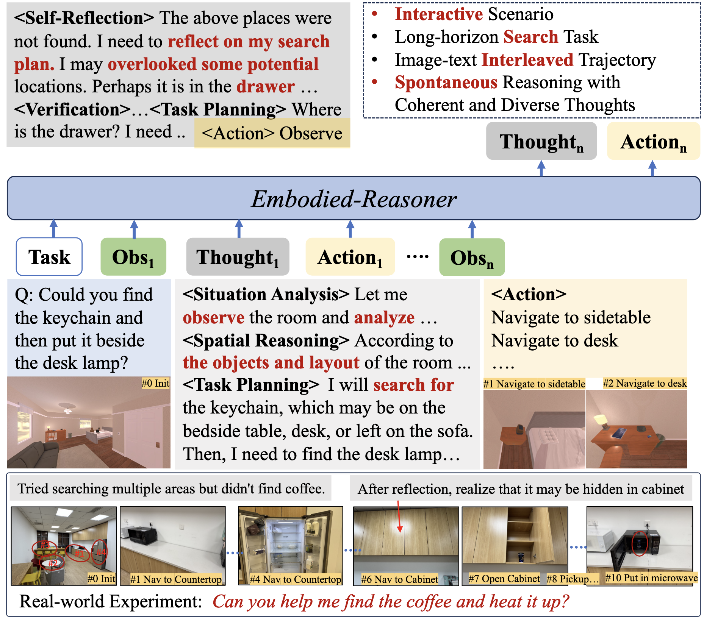

# Awesome-Embodied-Intelligence
## ⭐️introduction
## 👀content
- [⭐️ Introduction](#introduction)
- [🔥 News](#news)
- [📑 Papers](#papers)
  - [Survey](#survey)
  - [High-level Embodied Reasoning](#high-level-embodied-reasoning)
## 🔥news
[2025-04] We created this repository to organize papers and repositories related to Embodied Intelligence
## 📑Papers
### 📚survey 
**LLM Reasoning**
- Towards Reasoning Era: A Survey of Long Chain-of-Thought for Reasoning Large Language Models  
- A Survey of Efficient Reasoning for Large Reasoning Models: Language, Multimodality, and Beyond  
---
**Embodied AI**
- Aligning Cyber Space with Physical World: A Comprehensive Survey on Embodied AI 

**Vision Language Action Models**
- A Survey on Vision-Language-Action Models for Embodied AI

### 🤔 High-level Embodied Reasoning
| Title | Intro |  Resources |
|----------|-----|---------|
| Embodied-Reasoner: Synergizing Visual Search, Reasoning, and Action for Embodied Interactive Tasks     |  | [Code](https://github.com/zwq2018/embodied_reasoner) [Dataset](https://huggingface.co/datasets/zwq2018/embodied_reasoner/) [Website](https://github.com/zwq2018/embodied_reasoner)|

